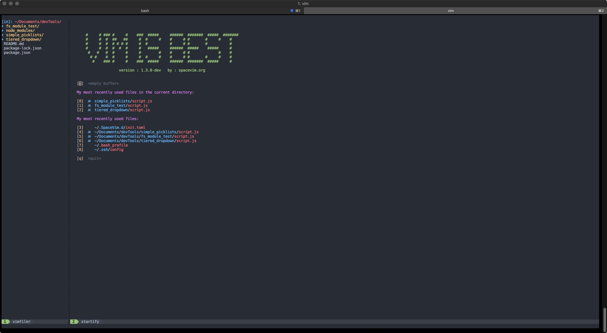
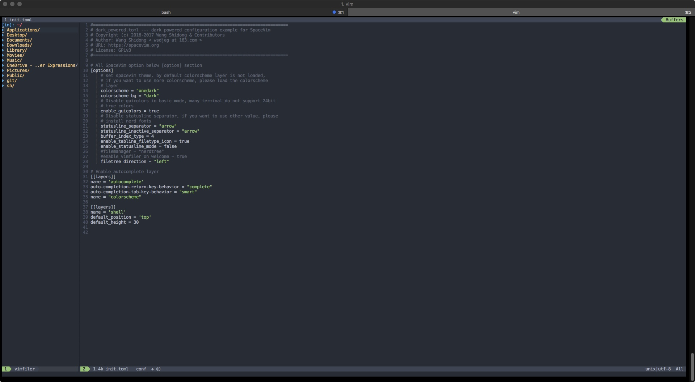

## SpaceVim Setup

#### Prepare terminal
- Install latest version of vim (8.1), run `brew install vim`
- Install nerd fonts
	- Run `brew tap homebrew/cask-fonts`
	- Run `brew cask install font-hack-nerd-font`
- In iTerm2 preferences (preferences > Profiles > Text):
	- Set iTerm2 font to 'DejaVu Sans Mono for Powerline' (optional)
	- Set iTerm2 non-ASCII font to 'Hack Nerd Font'

#### Install SpaceVim (https://spacevim.org/quick-start-guide/)
- To install, run `curl -sLf https://spacevim.org/install.sh | bash`
** When vim is launched for the first time, SpaceVim will install plugins.

#### Edit config file (https://spacevim.org/documentation/)
To configure SpaceVim, add/edit the file `~/.SpaceVim.d/init.toml`
- To move file tree to left side, add `filetree_direction = true` under '[options]'
- To change color scheme, add:

```
[options]
colorscheme = "onedark
colorscheme_bg = "dark"

[[layers]]
name = "colorsheme"
```
See (https://spacevim.org/layers/colorscheme/) for color scheme options.

- To add git to SpaceVim, add:
```
[[layers]]
name = "git"
```
- Show absolute line numbers instead of relative
```
[options]
relativenumber = false
```

#### Add bash alias to SpaceVim config file
Add `alias vimconfig='vim ~/.SpaceVim.d/init.toml'` to bash_profile aliases


#### Screenshots



***
[Table of Contents](../README.md)